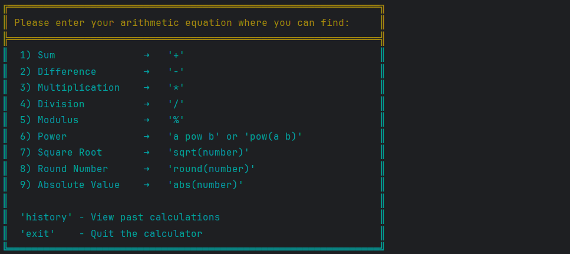

# Calculator Project
## _Kulnazarova Aiana COMCEH-24_ 
**Project Report**

**Project Description:**
This project is a simple command-line calculator that supports basic arithmetic operations like addition, subtraction, multiplication, division, modulus, exponentiation, square root, rounding, and absolute value. I used ANSI colors to make the interface look better and also stores the history of calculations, like in my past projects, by downloading JANSI library.

**How to Use the Calculator(examples):**

Run the program in the terminal.

Enter an arithmetic expression using supported operations:

Addition: 5 + 3

Subtraction: 10 - 4

Multiplication: 6 * 2

Division: 8 / 2

Modulus: 9 % 4

Power: 2 pow 3 or pow(2 3)

Square root: sqrt(16)

Round: round(4.7)

Absolute value: abs(-10)

To view past calculations, enter "history".

To exit, type "exit".

After each calculation, the program asks if you want to continue (y/n).

**Design Choices:**
- Used JANSI to add colors to the output.
- The user enters expressions as text, and the program processes them.
- Used Reverse Polish Notation (RPN) to handle operator precedence correctly.
- History is stored in an `ArrayList`.
- Used try-catch to handle errors and prevent crashes.
- I created a visually appealing table that serves as a menu for the calculator. This table lists all the available arithmetic operations and their corresponding symbols or syntax. It also includes additional commands like history to view past calculations and exit to quit the program. The table is displayed in the console with colored text to enhance readability and user experience.

**Algorithms and Data Structures Used:**
Data Structures:
- List<String> history:

A list to store the history of calculations as strings in the format expression = result.
Used to keep track of all calculations performed during the session.

- Stack<Double> nums:

A stack used in the calculateD method to evaluate the Reverse Polish Notation (RPN) expression.
Stores operands temporarily during the evaluation of the RPN expression.

- Stack<String> operators:

A stack used in the RPN method to convert the infix expression to postfix (RPN) notation.
Temporarily holds operators and parentheses during the conversion process.

- Map<String, Integer> priority:

A map that stores the precedence (priority) of operators and functions.
Used to determine the order of operations during the conversion from infix to RPN.

- List<String> tokens:

A list used in the tokenize method to store the tokens (numbers, operators, functions, and parentheses) extracted from the input expression.

**Algorithms**
- Tokenization (tokenize method):

Breaks the input expression into tokens (numbers, operators, functions, and parentheses).

Handles:

Numbers (integers and decimals, including negative numbers).
Operators (+, -, *, /, %).
Functions (pow, sqrt, round, abs).
Parentheses (( and )).
Uses a StringBuilder to construct multi-character tokens (e.g., numbers, functions).
Shunting Yard Algorithm (RPN method):
Converts the infix expression (standard arithmetic notation) to postfix notation (Reverse Polish Notation).
Uses a stack (operators) to manage operators and parentheses.

Processes tokens based on their type:

Numbers are added directly to the output list.
Operators are pushed onto the stack, respecting precedence and associativity.
Parentheses are used to group expressions and manage the stack.
Ensures the correct order of operations by popping higher-precedence operators from the stack to the output list.
Reverse Polish Notation Evaluation (calculateD method):
Evaluates the postfix expression (RPN) using a stack (nums).
Processes tokens:
Numbers are pushed onto the stack.
Operators and functions are applied to the operands popped from the stack.
The result of each operation is pushed back onto the stack.

Handles:

Basic arithmetic operations (+, -, *, /, %).
Mathematical functions (pow, sqrt, round, abs).

History Management:

The history list stores each calculation in the format expression = result.
The showHistory method displays the history of calculations, or a message if no history is available.

**Challenges Faced:**

- Had to learn try-catch to handle errors, because without it, the program would crash on invalid input.
- Understanding and implementing Reverse Polish Notation (RPN) was difficult because we didn’t study it before, so I had to learn how it works.
- Handling user input correctly was tricky, especially recognizing negative numbers, decimals, and different function formats.

**Improvements Made:**
- Fixed input parsing to handle different formats better.
- Improved error handling (now shows a message instead of crashing).
- Added a history feature to show previous calculations.
- Made the interface look nicer with colors.

**File Usage:**
- No files are used, everything is done in the console.
- Could add file support later to save history.

**Extra Notes:**
- The program can be expanded with more functions in the future.

